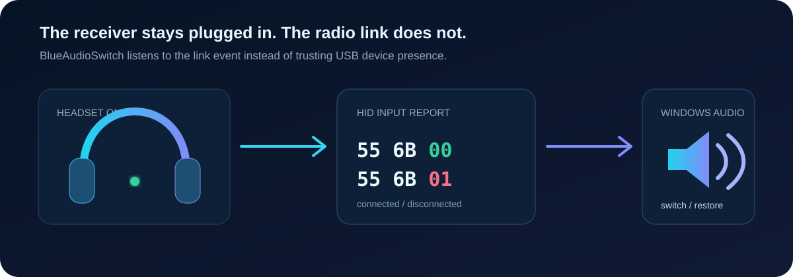

<p align="center">
  
</p>

# BlueAudioSwitch HS5

У Dark Project HS5 есть неприятная особенность: USB-донгл всегда виден в Windows как рабочее аудиоустройство. Даже когда наушники выключены, система считает, что `Динамики (DP-HS-1015)` на месте. Поэтому обычная проверка подключённых устройств здесь бесполезна.

Эта версия BlueAudioSwitch читает реальный статус радиосвязи из самого донгла. Включил HS5 — звук ушёл в наушники. Выключил — вернулся на устройство, которое использовалось до них.

Никакой прошивки, неизвестных команд донглу и постоянно установленного USB-сниффера.

<p align="center">
  
</p>

## Что умеет

- Видит настоящее подключение HS5, пока USB-приёмник постоянно вставлен в компьютер.
- Выбирает `Динамики (DP-HS-1015)` сразу после установки радиосвязи.
- Возвращает предыдущий аудиовыход после выключения гарнитуры.
- Сохраняет функции обычного BlueAudioSwitch: переподключение Bluetooth-аудио и выбор последнего подключённого устройства.
- Работает в фоне и запускается вместе с Windows.
- Не использует сеть, не собирает телеметрию и не читает аудиопоток.

## Установка

1. Скачай архив со страницы [Releases](../../releases/latest).
2. Распакуй его.
3. При желании сначала запусти `Test.cmd`.
4. Запусти `Install.cmd`.

Права администратора не нужны. Рабочая копия устанавливается в:

```text
%LOCALAPPDATA%\BlueAudioSwitch
```

Для удаления запусти `Uninstall.cmd`.

## Как донгл сообщает состояние

У приёмника `VID_10D6&PID_B011` есть служебная HID-коллекция `FF90`. При изменении радиосвязи она отправляет 64-байтный отчёт:

```text
55 6B 00 ... DP-HS-1015  # наушники подключились
55 6B 01 ... DP-HS-1015  # наушники отключились
```

BlueAudioSwitch только читает эти события. Подробности и способ проверки описаны в [docs/protocol.md](docs/protocol.md).

## Если не работает

Проверь, что у донгла действительно указан USB ID `VID_10D6&PID_B011`. Журнал находится здесь:

```text
%LOCALAPPDATA%\BlueAudioSwitch\BlueAudioSwitch.log
```

При обычном включении и выключении должны появиться строки с `HID 55-6B-00` и `HID 55-6B-01`.

## Лицензия

MIT. Исходное уведомление об авторских правах Wihred сохранено в [LICENSE](LICENSE).

